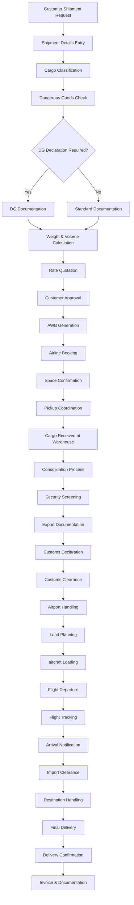
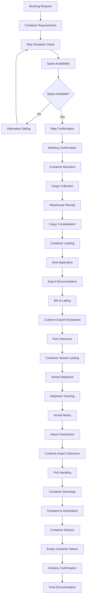
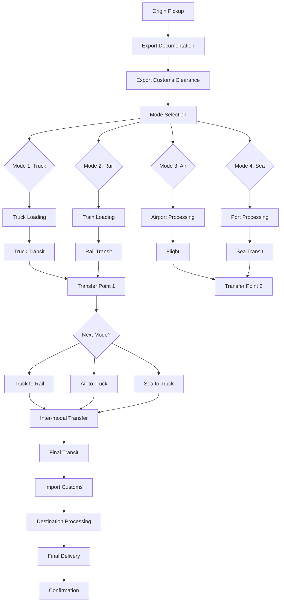
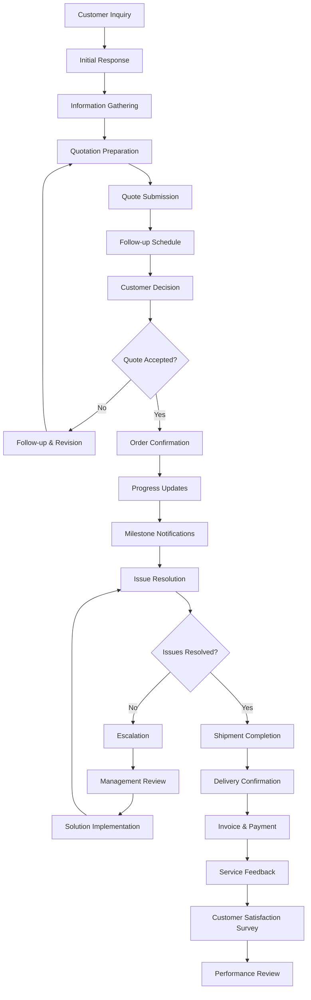
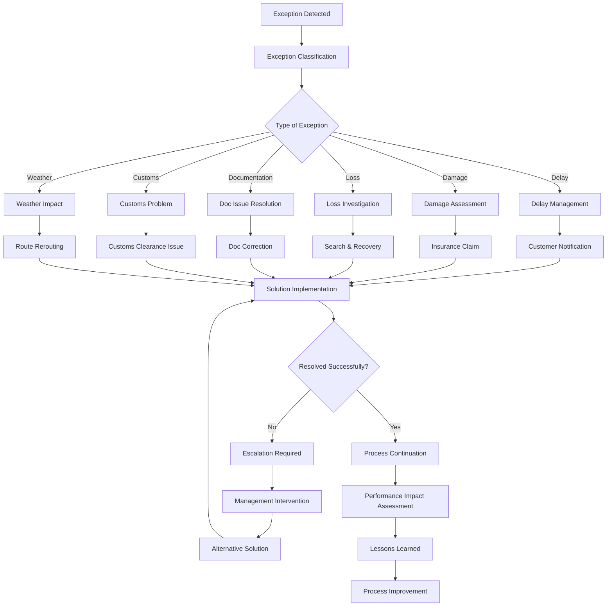

# Detailed Freight Forwarding Process Flowcharts

## 7. Air Freight (AWB) Management Process



## 8. Sea Freight (Container) Management Process



## 9. Multi-Modal Transport Process



## 10. Customer Service & Communication Flow



## 11. Vendor Management & Procurement Flow

```mermaid
graph TD
    A[Procurement Need Identified] --> B[Vendor Selection]
    B --> C[RFQ (Request for Quotation)]
    C --> D[Quote Collection]
    D --> E[Quote Analysis]
    E --> F[Vendor Evaluation]
    F --> G[Price Comparison]
    G --> H[Service Quality Assessment]
    H --> I[Contract Negotiation]
    I --> J{Vendor Selected?}
    J -->|No| K[Alternative Sourcing]
    K --> C
    J -->|Yes| L[Contract Signing]
    L --> M[Purchase Order Issue]
    M --> N[Service Delivery]
    N --> O[Quality Check]
    O --> P[Invoice Verification]
    P --> Q[Payment Processing]
    Q --> R[Performance Rating]
    R --> S[Vendor Scorecard Update]
    S --> T[Relationship Review]
    T --> U{Continue Partnership?}
    U -->|Yes| V[Contract Renewal]
    U -->|No| W[Vendor Replacement]
    V --> M
    W --> B
```

## 12. Exception Handling & Risk Management Flow



These detailed flowcharts provide comprehensive visualization of the complex processes involved in freight forwarding operations, covering all major transportation modes, customer service, vendor management, and exception handling scenarios.