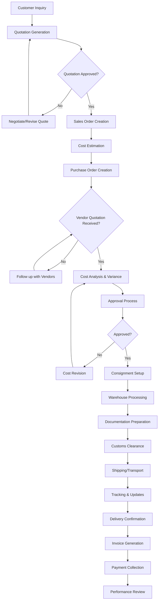
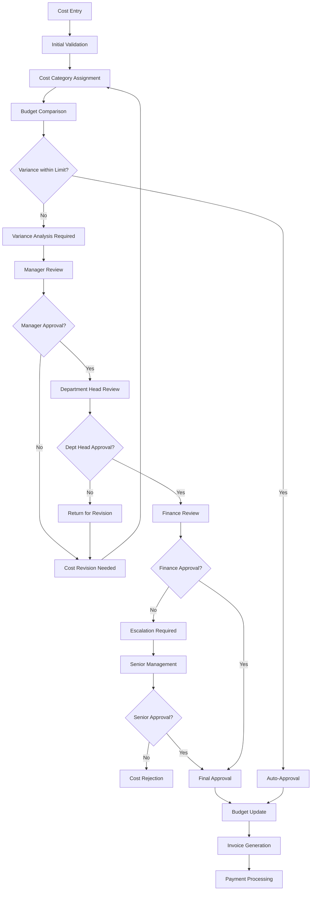
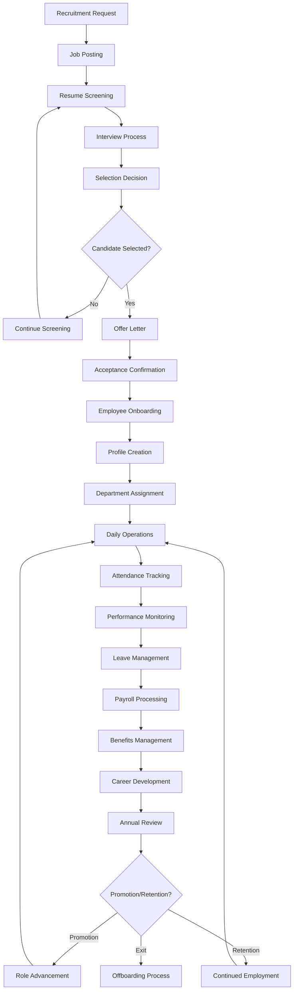
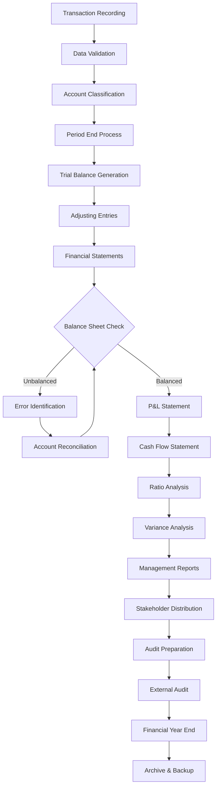

# Bakhtera1 Freight Forwarding Management System - Flowcharts

## 1. Main System Architecture Flowchart

```mermaid
graph TB
    A[User Login/Authentication] --> B[Main Dashboard]
    B --> C[Customer Management]
    B --> D[Sales Order Management]
    B --> E[Cost Management]
    B --> F[Purchase Order Management]
    B --> G[Vendor Management]
    B --> H[Warehouse Management]
    B --> I[Shipping Management]
    B --> J[AWB Management]
    B --> K[HR Management]
    B --> L[Financial Reporting]
    B --> M[Analytics & Reports]
    
    C --> C1[Customer Registration]
    C --> C2[Customer Profile]
    C --> C3[Contact Management]
    
    D --> D1[Quotation Creation]
    D --> D2[Order Processing]
    D --> D3[Status Tracking]
    
    E --> E1[Cost Entry]
    E --> E2[Variance Analysis]
    E --> E3[Approval Workflow]
    
    F --> F1[PO Creation]
    F --> F2[Vendor Quotation]
    F --> F3[Approval Process]
    
    G --> G1[Vendor Registration]
    G --> G2[Performance Tracking]
    G --> G3[Contract Management]
    
    H --> H1[Consignment Management]
    H --> H2[Inventory Tracking]
    H --> H3[Warehouse Operations]
    H --> H4[Customs Portal]
    
    I --> I1[Shipment Tracking]
    I --> I2[Carrier Management]
    I --> I3[Delivery Confirmation]
    
    J --> J1[AWB Generation]
    J --> J2[Airway Bill Tracking]
    J --> J3[Documentation]
    
    K --> K1[Employee Management]
    K --> K2[Attendance Tracking]
    K --> K3[Leave Management]
    K --> K4[Payroll Processing]
    
    L --> L1[Balance Sheet]
    L --> L2[Cash Flow]
    L --> L3[P&L Report]
    L --> L4[Aging Reports]
    
    M --> M1[Performance Metrics]
    M --> M2[KPI Dashboard]
    M --> M3[Custom Reports]
```

## 2. Freight Forwarding Process Flowchart

## 3. Warehouse Management Workflow

```mermaid
graph LR
    A[Consignment Received] --> B[Documentation Check]
    B --> C{Documentation Complete?}
    C -->|No| D[Request Missing Docs]
    D --> B
    C -->|Yes| E[Inventory Registration]
    E --> F[Cargo Inspection]
    F --> G[Storage Allocation]
    G --> H[Location Assignment]
    H --> I[Stock Level Update]
    I --> J[Cost Entry]
    J --> K[Status Update]
    K --> L{Mode of Transport}
    L -->|Sea Freight| M[Port Operations]
    L -->|Air Freight| N[Airport Operations]
    L -->|Land Transport| O[Ground Operations]
    
    M --> P[Container Handling]
    N --> Q[Cargo Processing]
    O --> R[Truck Loading]
    
    P --> S[Customs Clearance]
    Q --> S
    R --> S
    
    S --> T{Cleared?}
    T -->|No| U[Address Issues]
    U --> S
    T -->|Yes| V[Final Preparation]
    V --> W[Shipment Dispatch]
    W --> X[Delivery Tracking]
```

## 4. Cost Management & Approval Workflow

## 5. HR Management Process Flow

## 6. Financial Reporting Flowchart

These flowcharts provide a comprehensive overview of the key processes in your Bakhtera1 freight forwarding management system, showing the flow from initial customer inquiry through final delivery and payment collection, including all supporting processes like cost management, warehouse operations, HR, and financial reporting.